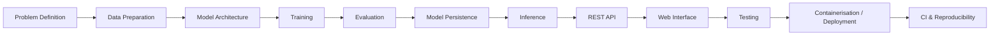

# AI Framework Demos

[](https://github.com/debolujimi/AI-Framework-Demos/actions/workflows/python-checks.yml)
[](https://github.com/debolujimi/AI-Framework-Demos/actions/workflows/reproducibility.yml)

A practical AI engineering and teaching portfolio demonstrating model development, training, evaluation, inference, API integration, testing and deployment with **TensorFlow, PyTorch and Keras**.

## Portfolio Snapshot

| Framework | Problem | Architecture | Engineering surface |
|---|---|---|---|
| **TensorFlow** | Cats vs Dogs image classification | CNN | Training, evaluation, Flask API, browser UI, Docker, API tests |
| **PyTorch** | English-to-German neural translation | Seq2Seq GRU | Training, evaluation, inference, Flask API, browser UI |
| **Keras** | IMDB sentiment classification | GloVe + LSTM | Training, held-out evaluation, inference, Flask API, browser UI |

### What this repository demonstrates

- end-to-end AI/ML application development rather than isolated notebooks;
- three major deep-learning frameworks across computer vision and NLP;
- explicit model evaluation and interpretation of accuracy, precision, recall, F1-score and loss;
- the distinction between **training memorisation and generalisation**;
- model persistence and reusable inference code;
- REST API and browser-interface integration;
- Docker containerisation for the TensorFlow service;
- automated GitHub Actions checks for Python source integrity and reproducible dependency environments.

> **Evaluation note:** results in this repository are demonstration-specific. In particular, the PyTorch translator's 100% exact-match result is measured on its six training examples and is documented as memorisation, not evidence of generalisation.

## Engineering Pipeline



## Technology Stack

**AI/ML:** TensorFlow, Keras, PyTorch, Torchvision, NumPy, GloVe  
**Application engineering:** Python, Flask, HTML, CSS, JavaScript, REST APIs  
**Delivery and quality:** Docker, Docker Compose, Pytest, GitHub Actions, Git

A practical teaching repository demonstrating the development, training, evaluation, inference, deployment, and use of Artificial Intelligence applications with **TensorFlow, PyTorch, and Keras**.

This repository contains three end-to-end AI demonstrations covering different areas of Artificial Intelligence:

- Computer Vision
- Neural Machine Translation
- Sentiment Analysis
- Model training and evaluation
- Model persistence
- Interactive inference
- REST API development
- Browser-based AI applications
- Docker deployment
- API testing
- Git and GitHub version control

---

## 1. Repository Overview

| Framework | AI Task | Model | Application |
|---|---|---|---|
| TensorFlow | Computer Vision | Convolutional Neural Network (CNN) | Cats vs Dogs Classification |
| PyTorch | Natural Language Processing | Seq2Seq GRU | English → German Translation |
| Keras | Natural Language Processing | GloVe + LSTM | Movie Review Sentiment Analysis |

The three demonstrations are intentionally different so that students can see how modern AI frameworks can be applied to different categories of problems.

---

## 2. Project Structure

```text
AI_Framework_Demos/
│
├── tensorflow_demo/
│   ├── trainModel.py
│   ├── predict.py
│   ├── evaluate_models.py
│   ├── app.py
│   ├── requirements.txt
│   ├── Dockerfile
│   ├── docker-compose.yml
│   ├── .dockerignore
│   ├── templates/
│   │   └── index.html
│   └── tests/
│       └── test_api.py
│
├── pytorch_demo/
│   ├── trainModel.py
│   ├── runModel.py
│   ├── evaluate_model.py
│   ├── app.py
│   └── templates/
│       └── index.html
│
├── keras_demo/
│   ├── trainModel.py
│   ├── runModel.py
│   ├── evaluate_model.py
│   ├── app.py
│   └── templates/
│       └── index.html
│
├── .gitignore
└── README.md
```

Large datasets, trained model files, virtual environments, GloVe embeddings, caches, and other generated artefacts are excluded from Git where appropriate.

---

# 3. Development Environment

The project was developed using **Python 3.12** inside a Python virtual environment.

## Create the Virtual Environment

From the project root:

```powershell
python -m venv .venv
```

Activate it on Windows PowerShell:

```powershell
.\.venv\Scripts\Activate.ps1
```

When activated, the terminal should display something similar to:

```text
(.venv) PS C:\Users\pc\Desktop\AI_Framework_Demos>
```

---

## Framework Versions Used

The demonstrations were developed using approximately the following framework versions:

| Technology | Version |
|---|---:|
| Python | 3.12 |
| TensorFlow | 2.21.0 |
| Keras | 3.15.1 |
| PyTorch | 2.13.0+cpu |
| Torchvision | 0.28.0+cpu |

The project was primarily developed and tested using **CPU execution**.

TensorFlow and PyTorch may display messages indicating that CUDA or GPU support is unavailable. This does not prevent the demonstrations from running on CPU.

---

# 4. TensorFlow Demo — Cats vs Dogs Image Classification

## 4.1 Objective

The TensorFlow demonstration develops a Computer Vision application capable of classifying an uploaded image as either:

- **CAT**
- **DOG**

The project demonstrates the complete workflow from image data preparation through CNN training, evaluation, prediction, API development, testing, and Docker deployment.

---

## 4.2 TensorFlow Pipeline

```text
Cats & Dogs Dataset
        ↓
Image Loading
        ↓
Image Resizing
        ↓
Normalisation
        ↓
Training / Validation Data
        ↓
Convolutional Neural Network
        ↓
Model Training
        ↓
Model Validation
        ↓
Model Evaluation
        ↓
Model Persistence
        ↓
Prediction
        ↓
Flask REST API
        ↓
Web Interface
        ↓
Docker Containerisation
        ↓
API Testing
```

---

## 4.3 Model Development

Two CNN models were developed and evaluated:

### Model 1 — Basic CNN

A comparatively large CNN architecture used as the initial image-classification model.

### Model 2 — Improved CNN

A significantly smaller architecture designed to explore the trade-off between model complexity and predictive performance.

---

## 4.4 Train the TensorFlow Models

Navigate to the TensorFlow project:

```powershell
cd tensorflow_demo
```

Run:

```powershell
python trainModel.py
```

The training process produces trained Keras/TensorFlow model files.

These model files are excluded from Git because trained models can be regenerated from the training code.

---

## 4.5 Evaluate the TensorFlow Models

Run:

```powershell
python evaluate_models.py
```

The models were evaluated using **1,000 validation images**.

### Evaluation Results

| Metric | Model 1 — Basic CNN | Model 2 — Improved CNN |
|---|---:|---:|
| Parameters | 10,636,481 | 101,569 |
| File size | 121.76 MB | 1.21 MB |
| Validation accuracy | **65.60%** | 63.10% |
| Validation loss | 1.6953 | **0.6325** |
| Precision | **66.60%** | 62.38% |
| Recall | 62.60% | **66.00%** |
| F1-score | **64.54%** | 64.14% |
| Average confidence | 91.50% | 60.69% |

### Confusion Matrix Values

#### Model 1

```text
True Negative:  343
False Positive: 157
False Negative: 187
True Positive:  313
```

#### Model 2

```text
True Negative:  301
False Positive: 199
False Negative: 170
True Positive:  330
```

---

## 4.6 TensorFlow Model Interpretation

Model 1 achieved slightly higher:

- validation accuracy;
- precision; and
- F1-score.

Model 2 achieved higher recall and substantially lower validation loss.

More importantly, Model 2 contains only **101,569 parameters**, compared with more than **10.6 million parameters** in Model 1.

This provides an important teaching example:

> The largest neural network is not automatically the best model for deployment.

Model selection may require balancing:

- accuracy;
- precision;
- recall;
- model size;
- computational requirements;
- inference performance; and
- deployment constraints.

---

## 4.7 Run the TensorFlow Web Application

The TensorFlow application is deployed through Docker.

From:

```text
AI_Framework_Demos\tensorflow_demo
```

run:

```powershell
docker compose up -d
```

Check the container:

```powershell
docker compose ps
```

The application is available at:

```text
http://127.0.0.1:5000
```

Open that address in a browser to upload an image and obtain a prediction.

---

## 4.8 TensorFlow Health Check

```powershell
curl.exe http://127.0.0.1:5000/health
```

Example response:

```json
{
  "model": "model1_basic_cnn",
  "service": "cats-dogs-ai",
  "status": "healthy"
}
```

---

## 4.9 TensorFlow Prediction API

Example:

```powershell
curl.exe -X POST -F "image=@cats_and_dogs\test\1.jpg" http://127.0.0.1:5000/predict
```

Example response:

```json
{
  "confidence": 0.9972563982009888,
  "prediction": "DOGS"
}
```

---

## 4.10 TensorFlow Automated Tests

The TensorFlow API includes automated testing with `pytest`.

Run:

```powershell
python -m pytest -v
```

The completed demonstration produced:

```text
5 passed
```

Tests include:

- home page;
- health endpoint;
- prediction without an image;
- prediction with a valid image; and
- known demonstration image.

---

## 4.11 Stop the TensorFlow Application

Run:

```powershell
docker compose down
```

---

# 5. PyTorch Demo — English to German Neural Machine Translation

## 5.1 Objective

The PyTorch demonstration introduces **Natural Language Processing** through a simple English-to-German neural machine translation system.

The project demonstrates a **Sequence-to-Sequence (Seq2Seq)** architecture using:

- embeddings;
- GRU recurrent neural networks;
- encoder-decoder architecture; and
- teacher forcing.

---

## 5.2 PyTorch Pipeline

```text
English Sentence
       ↓
Tokenisation
       ↓
Vocabulary Construction
       ↓
Numericalisation
       ↓
Special Tokens
       ↓
Padding
       ↓
Word Embeddings
       ↓
GRU Encoder
       ↓
Hidden Representation
       ↓
GRU Decoder
       ↓
Output Probabilities
       ↓
German Tokens
       ↓
German Sentence
```

---

## 5.3 Demonstration Dataset

The deliberately small teaching dataset contains the following sentence pairs:

```text
hello                  → hallo
this                   → das
is                     → ist
a                      → ein
test                   → test
hello this is a test   → hallo das ist ein test
```

This tiny dataset is intentionally used to make the mechanics of Seq2Seq learning easy to demonstrate.

It is **not intended to represent a production-quality translation dataset**.

---

## 5.4 Tokenisation

Simple whitespace tokenisation is used.

This was adopted because spaCy native extensions were blocked by Windows Application Control in the development environment.

Special tokens include:

```text
<unk>  Unknown token
<pad>  Padding token
<bos>  Beginning of sentence
<eos>  End of sentence
```

---

## 5.5 PyTorch Model Architecture

The model consists of an encoder and decoder.

### Encoder

```text
English Tokens
      ↓
Embedding
      ↓
GRU
      ↓
Hidden State
```

### Decoder

```text
Previous German Token
        ↓
Embedding
        ↓
GRU
        ↓
Linear Layer
        ↓
Next German Token
```

### Combined Architecture

```text
English Sentence
       ↓
    Encoder
       ↓
 Hidden State
       ↓
    Decoder
       ↓
German Sentence
```

---

## 5.6 Model Configuration

```text
English vocabulary size: 9
German vocabulary size:  9
Hidden size:             128
Batch size:              1
Learning rate:           0.001
Teacher forcing ratio:   1.0
Epochs:                  1000
```

Model parameters:

```text
Total parameters:     201,609
Trainable parameters: 201,609
```

---

## 5.7 Train the PyTorch Model

Navigate to:

```powershell
cd pytorch_demo
```

Run:

```powershell
python trainModel.py
```

During the completed training run, loss decreased from approximately:

```text
Initial loss: 2.1780
```

to approximately:

```text
Final loss: 0.0000
```

The trained model checkpoint is saved as:

```text
translation_model.pth
```

The `.pth` model file is excluded from Git.

---

## 5.8 Run Interactive Translation

Run:

```powershell
python runModel.py
```

The program loads the trained model and provides automatic demonstration translations.

Example:

```text
hello                  → hallo
this                   → das
is                     → ist
a                      → ein
test                   → test
hello this is a test   → hallo das ist ein test
```

It then provides an interactive terminal:

```text
English:
```

Enter a supported English sentence and the model generates a German translation.

Type:

```text
quit
```

to exit.

---

## 5.9 Evaluate the PyTorch Model

Run:

```powershell
python evaluate_model.py
```

### Evaluation Results

| Metric | Result |
|---|---:|
| Known sentence pairs | 6 |
| Exact matches | 6 |
| Sentence exact-match accuracy | 100.00% |
| Token-level accuracy | 100.00% |
| Total parameters | 201,609 |
| Trainable parameters | 201,609 |
| Checkpoint size | 0.783 MB |
| Initial training loss | 2.177963 |
| Final training loss | 0.000008 |

---

## 5.10 Important PyTorch Evaluation Limitation

The 100% sentence and token accuracy results are measured on the **six sentence pairs used during training**.

They therefore measure **memorisation of the demonstration dataset**, not generalisation to unseen natural language.

When presented with unseen sentence combinations, the model can generate incorrect outputs.

For example, during evaluation, unseen inputs produced outputs such as:

```text
this is a test   → hallo das ist ein test
hello test       → hallo das ist ein test
a test           → hallo das ist ein test
hello this       → hallo das ist ein test
good morning     → hallo
```

This behaviour is pedagogically valuable because it demonstrates the difference between:

- low training loss;
- training accuracy;
- memorisation;
- overfitting; and
- generalisation.

A model can achieve nearly perfect training performance while still performing poorly on unseen data.

---

## 5.11 Run the PyTorch Flask Application

Run:

```powershell
python app.py
```

The application runs at:

```text
http://127.0.0.1:5001
```

Open this address in a browser to use the translation interface.

---

## 5.12 PyTorch Health Endpoint

```powershell
curl.exe http://127.0.0.1:5001/health
```

Example response:

```json
{
  "framework": "PyTorch",
  "model": "GRU Seq2Seq",
  "service": "pytorch-translation-ai",
  "status": "healthy"
}
```

---

## 5.13 PyTorch Translation API

In PowerShell:

```powershell
curl.exe -X POST `
  -H "Content-Type: application/json" `
  -d '{"sentence":"hello this is a test"}' `
  http://127.0.0.1:5001/translate
```

Example response:

```json
{
  "english": "hello this is a test",
  "german": "hallo das ist ein test"
}
```

PowerShell's native REST client can also be used:

```powershell
Invoke-RestMethod `
  -Uri "http://127.0.0.1:5001/translate" `
  -Method POST `
  -ContentType "application/json" `
  -Body '{"sentence":"hello this is a test"}'
```

---

# 6. Keras Demo — Movie Review Sentiment Analysis

## 6.1 Objective

The Keras demonstration develops a Natural Language Processing application capable of classifying movie reviews as:

- **POSITIVE**
- **NEGATIVE**

The model uses the IMDB movie review dataset, pre-trained GloVe word embeddings, and an LSTM recurrent neural network.

---

## 6.2 Keras Pipeline

```text
IMDB Movie Reviews
        ↓
Integer Encoding
        ↓
Sequence Padding / Truncation
        ↓
IMDB Vocabulary
        ↓
GloVe Embedding Matrix
        ↓
Embedding Layer
        ↓
LSTM
        ↓
Dropout
        ↓
Dense Layer
        ↓
Dropout
        ↓
Sigmoid Output
        ↓
POSITIVE / NEGATIVE
```

---

## 6.3 IMDB Dataset

The demonstration uses the Keras IMDB dataset.

Dataset size:

```text
Training reviews: 25,000
Testing reviews:  25,000
```

Sequences are padded or truncated to:

```text
200 tokens
```

---

## 6.4 GloVe Word Embeddings

The project uses pre-trained **GloVe 6B embeddings**.

Configuration:

```text
Embedding dimensions: 100
GloVe vectors:        400,000
Vocabulary size:      10,000
Matched words:        9,793
```

The embedding matrix therefore has shape:

```text
(10000, 100)
```

The pre-trained embedding layer is frozen during training.

---

## 6.5 Keras LSTM Architecture

```text
Input Review
     ↓
Embedding Layer
(10,000 × 100)
     ↓
LSTM
64 units
     ↓
Dropout
     ↓
Dense
32 units + ReLU
     ↓
Dropout
     ↓
Dense
1 unit + Sigmoid
     ↓
Sentiment Probability
```

Model parameters:

```text
Total parameters:         1,044,353
Trainable parameters:        44,353
Non-trainable parameters: 1,000,000
```

The majority of parameters belong to the frozen GloVe embedding matrix.

---

## 6.6 Train the Keras Model

Navigate to:

```powershell
cd keras_demo
```

Run:

```powershell
python trainModel.py
```

The completed training run used:

```text
10 epochs
```

Final training metrics:

| Metric | Result |
|---|---:|
| Training accuracy | 87.77% |
| Validation accuracy | 87.82% |
| Training loss | 0.2980 |
| Validation loss | 0.3052 |

The model is saved locally as:

```text
keras_sentiment_model.keras
```

The trained `.keras` file is excluded from Git.

---

## 6.7 Evaluate the Keras Model

Run:

```powershell
python evaluate_model.py
```

The model is evaluated against **25,000 held-out IMDB test reviews**.

### Final Test Results

| Metric | Result |
|---|---:|
| Test reviews | 25,000 |
| Test accuracy | **87.30%** |
| Test loss | 0.3083 |
| Precision | 86.42% |
| Recall | 88.50% |
| F1-score | **87.45%** |
| Average confidence | 90.25% |
| True positives | 11,063 |
| True negatives | 10,762 |
| False positives | 1,738 |
| False negatives | 1,437 |
| Total parameters | 1,044,353 |
| Trainable parameters | 44,353 |
| Non-trainable parameters | 1,000,000 |
| Model file size | 4.357 MB |

---

## 6.8 Keras Confusion Matrix

```text
                    Predicted
                 Negative  Positive

Actual Negative     10762      1738
Actual Positive      1437     11063
```

Unlike the small PyTorch demonstration, these Keras metrics are calculated on **25,000 held-out reviews**.

The results therefore provide a meaningful indication of the model's ability to **generalise to unseen data**.

---

## 6.9 Run Interactive Keras Inference

Run:

```powershell
python runModel.py
```

Example positive review:

```text
This movie was absolutely brilliant and I loved every minute of it.
```

Example output:

```text
Prediction: POSITIVE
Confidence: 81.54%
```

Example negative review:

```text
The movie was boring, disappointing and a complete waste of time.
```

Example output:

```text
Prediction: NEGATIVE
Confidence: 99.57%
```

Type:

```text
quit
```

to close the interactive program.

---

## 6.10 Run the Keras Flask Application

Run:

```powershell
python app.py
```

The web application runs at:

```text
http://127.0.0.1:5002
```

Open this address in a browser to enter movie reviews and obtain sentiment predictions.

---

## 6.11 Keras Health Endpoint

```powershell
curl.exe http://127.0.0.1:5002/health
```

Example response:

```json
{
  "backend": "tensorflow",
  "framework": "Keras",
  "model": "GloVe LSTM Sentiment Classifier",
  "service": "keras-sentiment-ai",
  "status": "healthy"
}
```

---

## 6.12 Keras Prediction API

Positive example:

```powershell
curl.exe -X POST `
  -H "Content-Type: application/json" `
  -d '{"review":"This movie was absolutely fantastic and I loved it"}' `
  http://127.0.0.1:5002/predict
```

Example response:

```json
{
  "confidence": 0.9481825232505798,
  "review": "This movie was absolutely fantastic and I loved it",
  "score": 0.9481825232505798,
  "sentiment": "POSITIVE"
}
```

Negative example:

```powershell
curl.exe -X POST `
  -H "Content-Type: application/json" `
  -d '{"review":"This movie was terrible boring and disappointing"}' `
  http://127.0.0.1:5002/predict
```

Example response:

```json
{
  "confidence": 0.9856873359531164,
  "review": "This movie was terrible boring and disappointing",
  "score": 0.014312664046883583,
  "sentiment": "NEGATIVE"
}
```

---

# 7. TensorFlow vs PyTorch vs Keras

The three demonstrations provide complementary examples of AI development.

| Feature | TensorFlow | PyTorch | Keras |
|---|---|---|---|
| Primary domain | Computer Vision | NLP | NLP |
| Task | Image classification | Translation | Sentiment classification |
| Architecture | CNN | Seq2Seq GRU | LSTM |
| Input | Images | English text | Movie reviews |
| Output | Cat / Dog | German text | Positive / Negative |
| Model format | `.keras` | `.pth` | `.keras` |
| Web framework | Flask | Flask | Flask |
| Application port | 5000 | 5001 | 5002 |
| Docker deployment | Yes | Not currently | Not currently |
| Evaluation basis | Validation images | Training examples | Held-out test data |

---

# 8. Complete AI Engineering Pipeline Demonstrated

Taken together, the three projects illustrate the broader AI engineering lifecycle:

```text
Problem Definition
        ↓
Data Acquisition
        ↓
Data Exploration
        ↓
Data Preprocessing
        ↓
Feature / Input Representation
        ↓
Model Architecture
        ↓
Model Training
        ↓
Validation
        ↓
Model Evaluation
        ↓
Model Persistence
        ↓
Inference
        ↓
REST API Development
        ↓
Web Interface
        ↓
Testing
        ↓
Containerisation
        ↓
Deployment
        ↓
Version Control
        ↓
Documentation
```

This demonstrates that developing an AI application involves considerably more than simply training a neural network.

---

# 9. Key Learning Outcomes

After completing the demonstrations, students should be able to explain and practically demonstrate:

1. How AI datasets are prepared for model training.
2. How neural networks learn from training data.
3. The role of training, validation, and test datasets.
4. How CNNs process image data.
5. How recurrent neural networks process sequential data.
6. How embeddings represent words numerically.
7. How encoder-decoder architectures support sequence transformation.
8. How LSTMs can perform text classification.
9. How model predictions are evaluated.
10. Why accuracy should not be interpreted in isolation.
11. The importance of precision, recall, F1-score, loss, and confusion matrices.
12. The difference between memorisation and generalisation.
13. How trained AI models are saved and loaded.
14. How AI models can be exposed through REST APIs.
15. How Flask can provide browser-based AI interfaces.
16. How Docker can package an AI application.
17. How automated tests can validate an AI service.
18. How Git and GitHub support AI software development and version control.

---

# 10. Important Experimental Lessons

## 10.1 Training Accuracy Is Not Generalisation

The PyTorch model demonstrates an important machine-learning principle.

The model achieved:

```text
100% exact-match accuracy
```

on its six training examples.

However, it did not reliably translate unseen sentence combinations.

This demonstrates that:

```text
Excellent training performance
             ≠
Excellent real-world performance
```

A model can memorise training examples without learning sufficiently generalisable patterns.

---

## 10.2 Accuracy Alone Is Insufficient

The TensorFlow models demonstrate why model evaluation should consider several metrics.

A model may achieve higher accuracy but perform differently in terms of:

- precision;
- recall;
- F1-score;
- loss;
- confidence;
- model size; and
- computational cost.

Therefore:

```text
Model Evaluation
      ≠
Accuracy Only
```

---

## 10.3 Preprocessing Matters

The Keras sentiment-analysis experiment demonstrates the importance of correct input representation and preprocessing.

Sequence preparation, padding, vocabulary mapping, embedding construction, and masking can materially affect model performance.

The final model achieved approximately:

```text
87.30% test accuracy
```

on held-out IMDB reviews.

---

## 10.4 Model Size Matters

The TensorFlow comparison provides an especially useful deployment lesson.

Model 1:

```text
10,636,481 parameters
121.76 MB
```

Model 2:

```text
101,569 parameters
1.21 MB
```

Despite the enormous difference in size, their validation accuracies were relatively close:

```text
Model 1: 65.60%
Model 2: 63.10%
```

This illustrates the trade-off between:

```text
Predictive Performance
        ↕
Model Complexity
        ↕
Storage
        ↕
Computational Cost
        ↕
Deployment Requirements
```

---

# 11. Framework Perspective

## TensorFlow

TensorFlow provides a broad ecosystem for:

- machine learning;
- deep learning;
- production deployment;
- model serving;
- distributed computing; and
- AI application development.

In this repository, TensorFlow is demonstrated through a **Computer Vision CNN application**.

---

## PyTorch

PyTorch provides a flexible and explicit programming model that is particularly useful for understanding:

- tensors;
- neural-network modules;
- training loops;
- backpropagation;
- optimisation; and
- custom model architectures.

In this repository, PyTorch is demonstrated through a **Seq2Seq neural machine translation application**.

---

## Keras

Keras provides a high-level neural-network API designed to simplify model construction and experimentation.

The demonstration uses Keras with the:

```text
TensorFlow backend
```

In this repository, Keras is demonstrated through a **GloVe + LSTM sentiment-analysis application**.

---

# 12. Model Persistence

Each framework demonstrates model persistence.

### TensorFlow

```text
model1_basic_cnn.keras
model2_improved_cnn.keras
```

### PyTorch

```text
translation_model.pth
```

### Keras

```text
keras_sentiment_model.keras
```

These generated model files are intentionally excluded from the Git repository.

They can be regenerated by executing the appropriate training scripts.

---

# 13. Git and Large Files

The root `.gitignore` prevents unnecessary or very large generated files from being committed.

Examples include:

```text
.venv/
__pycache__/
*.keras
*.pth
datasets
GloVe files
cache files
generated model artefacts
```

This keeps the GitHub repository focused on:

- source code;
- configuration;
- documentation;
- tests; and
- reproducible project logic.

---

# 14. Git Workflow

A typical workflow after modifying the project is:

```powershell
git status
```

Stage changes:

```powershell
git add .
```

Commit:

```powershell
git commit -m "Describe the changes"
```

Push:

```powershell
git push origin main
```

Verify:

```powershell
git status
```

Expected final state:

```text
On branch main
Your branch is up to date with 'origin/main'.

nothing to commit, working tree clean
```

---

# 15. Running the Three Applications

The three demonstrations use different ports so that their services can be distinguished easily.

| Application | URL |
|---|---|
| TensorFlow Cats vs Dogs | `http://127.0.0.1:5000` |
| PyTorch Translator | `http://127.0.0.1:5001` |
| Keras Sentiment Analysis | `http://127.0.0.1:5002` |

---

# 16. Educational Purpose

This repository was developed as a practical AI teaching resource.

Rather than demonstrating only isolated model-training commands, the projects illustrate how machine-learning models become complete AI applications.

The three demonstrations cover:

```text
TensorFlow
    ↓
Computer Vision
    ↓
Cats vs Dogs Classification


PyTorch
    ↓
Natural Language Processing
    ↓
English → German Translation


Keras
    ↓
Natural Language Processing
    ↓
Movie Review Sentiment Analysis
```

Together they provide students with practical exposure to multiple AI frameworks, architectures, data types, evaluation approaches, and deployment techniques.

---

# 17. From AI Model to AI System

One of the central lessons of this repository is the distinction between an **AI model** and an **AI system**.

Training produces a model:

```text
Data
 ↓
Training
 ↓
Model
```

But a usable AI application requires additional engineering:

```text
Data
 ↓
Preprocessing
 ↓
Model
 ↓
Evaluation
 ↓
Model Persistence
 ↓
Inference Logic
 ↓
REST API
 ↓
User Interface
 ↓
Testing
 ↓
Deployment
 ↓
Monitoring / Maintenance
```

This broader pipeline represents the transition from **machine-learning experimentation to AI engineering**.

---

# 18. Future Improvements

Possible future extensions to the repository include:

- larger training datasets;
- transfer learning;
- GPU training;
- improved CNN architectures;
- attention mechanisms;
- Transformer-based translation;
- larger bilingual corpora;
- advanced sentiment models;
- automated CI/CD testing;
- Dockerisation of all three applications;
- cloud deployment;
- model monitoring;
- experiment tracking; and
- comparison with modern pre-trained foundation models.

---

# 19. Technology Stack

The repository demonstrates the use of:

- Python
- TensorFlow
- Keras
- PyTorch
- Torchvision
- NumPy
- GloVe word embeddings
- Flask
- HTML
- CSS
- JavaScript
- REST APIs
- Docker
- Docker Compose
- Pytest
- Git
- GitHub
- Visual Studio Code

---

# 20. Summary

The **AI Framework Demos** repository contains three practical AI applications:

### TensorFlow

**Cats vs Dogs Image Classification**

```text
Images → CNN → Classification → Flask API → Docker
```

### PyTorch

**English-to-German Translation**

```text
English → Embedding → GRU Encoder → GRU Decoder → German
```

### Keras

**Movie Review Sentiment Analysis**

```text
Review → GloVe → LSTM → Sigmoid → Positive / Negative
```

Together, the projects demonstrate the transition from:

```text
AI Theory
   ↓
Data
   ↓
Model Development
   ↓
Training
   ↓
Evaluation
   ↓
Inference
   ↓
API
   ↓
Web Application
   ↓
Deployment
   ↓
Version Control
```

The repository can therefore be used as both a **teaching resource** and a practical introduction to end-to-end AI application development.

---

# Author

**Peter Olujimi**

Artificial Intelligence Engineering / Development  
AI Training and Research